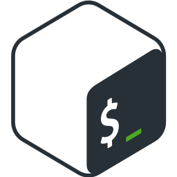

# Hi there 👋

I'm Stian Gabrielsen, a passionate developer exploring the fascinating world of web development and server management!

- 🔭 **What I’m currently working on:** I'm currently working on front-end web development using HTML and CSS ATM.
- 🌱 **What I’m currently learning:** My journey currently involves delving into web development. I'm picking up new skills and technologies every day, making sure I stay on the cutting edge of development practices.
- 👯 **Collaboration:** I’m looking forward to collaborating with talented developers like [Simon Sandvik Lee](https://github.com/sandviklee) and [Sverre Nystad](https://github.com/SverreNystad). I believe in the power of teamwork and learning from others.
- 🤔 **Seeking help:** I’m on the lookout for guidance in mastering the fundamentals of Frontend. If you have expertise in these areas, let’s connect!
- 💬 **Ask me about:** Feel free to ask me about PHP development, managing Raspberry Pi servers, and transitioning into web development. I'm always eager to share my experiences and learn from others. Also any tips would be great.
- 📫 **How to reach me:** The best way to reach me is "stianbga@stud.ntnu.no" I’m always open to interesting conversations and new opportunities.
- 😄 **Pronouns:** He/Him.
- 🏦 **Education:** NTNU Webdesign

##  🧑‍💻 Tech I work on: </h2>

       
       
       
       
       
       

<h2>⚙️ GitHub Stats</h2>

  <picture>
    <source media="(prefers-color-scheme: dark)" srcset="https://github-readme-stats-nine-bay-97.vercel.app/api?username=StianGabrielsen&show_icons=true&border_color=414868&theme=tokyonight"/>
    <source media="(prefers-color-scheme: light)" srcset="https://github-readme-stats-nine-bay-97.vercel.app/api?username=StianGabrielsen&show_icons=true"/>
    
  </picture>
  <picture>
    <source media="(prefers-color-scheme: dark)" srcset="https://github-readme-stats-nine-bay-97.vercel.app/api/top-langs/?username=StianGabrielsen&layout=compact&border_color=414868&theme=tokyonight"/>
    <source media="(prefers-color-scheme: light)" srcset="https://github-readme-stats-nine-bay-97.vercel.app/api/top-langs/?username=StianGabrielsen&layout=compact">
    
  </picture>

